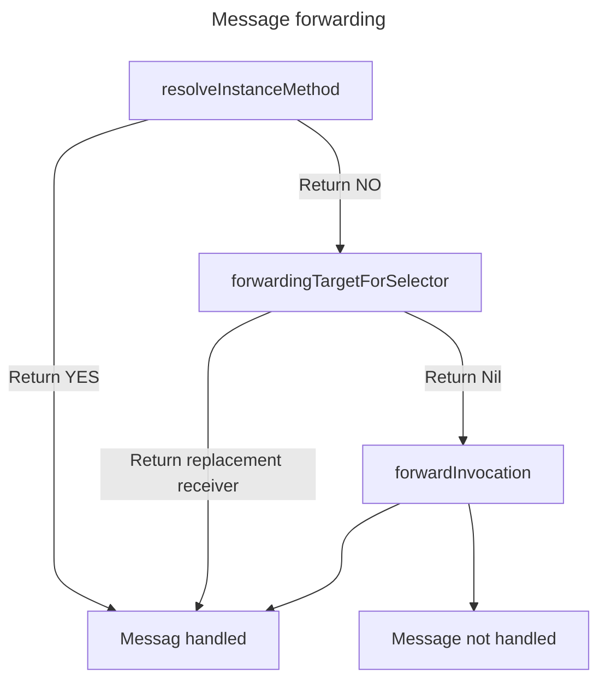

# Effective-Objective-C

## 适应OC

### OC是消息调用， 而不是直接的函数调用

### 最小化import

import会增加header的大小，尽可能的最小化import， 将import放在.m, .c, cpp, .mm文件中
可以使用以下形式最小化

```objective-c
#import <Foundation/Foundation>
@class EOCEmployer;

@interface EOCPerson: NSObject
@property (nonatomic, copy) NSString *firstName;
@property (nonatomic, copy) NSString *lastName;
@property (nonatomic, strong) EOCEmployer *employer;
@end
```

而在EOCPerson.m文件中

```objective-c
#import "EOCPerson.h"
#import "EOCEmployer.h"

@implementation EOCPerson
//Implementation of methods
@end
```

对于protocol， 如果不向外暴露的话， 可以考虑在.m文件中实现

### 优先使用字面量

```objective-c
NSNumber *someNumber = [NSNumber numberWithInt: 1];
//but this is better
NSNumber *someNumber = @1;
```

### 优先使用类型常量而不是宏

优先把常量声明在.m中, .h文件可以通过**_extern_**引入

```objective-c
//EOCLoginManager.h
#import <Foundation/Foundation.h>
extern NSString *const EOCLoginManagerDidLoginNotification;

@interface EOCLoginManager: NSObject
- (void) login;
@end

///EOCLoginManager.m
#import "EOCLoginManager.h"

NSString *const EOCLoginManagerDidLoginNotification = @"EOCLoginManagerDidLoginNotification";

@implementation EOCLoginManager

-(void) login{

}

-(void) p_didLogin{
    [[NSNotificationCenter defaultCenter]
        postNotificationName: EOCLoginManagerDidLoginNotification
            object: nil];
}
@end
```

### 使用枚举来管理状态

NS_ENUM 在是否是C++环境下有不同的定义
C++环境下，两个枚举按位或所得值将会是NSUInteger， 而不是枚举本身
同时不允许隐式转换成枚举
在需要操作枚举值的情况下，应使用NS_OPTIONS

```objective-c
typedef NS_ENUM(NSUInteger, EOCConnectionState) {
    EOCConnectionStateDisconnected,
    EOCConnectionStateConnecting,
    EOCConnectionStateConnected,
};

switch(_currentState){
    EOCConnectionStateDisConnected:
        //Handle disconnected state
        break;
    EOCConnectionStateConnecting:
        //Handle connecting state
        break;
EOCConnectionStateConnected:
        //Handle connected state
        break;
}
```

## Objects, Messaging & Runtime

### properties

尽可能使用getter和setter来访问instance variable 而不是通过直接访问
通过增加@synthesize 关键字可以重命名getter跟setter方法构造的方法名

```objective-c
@implementation EOCPerson
@synthesize firstName = _myFirstName;
@synthesize lastName = _myLastName;
```

使用@dynamic关键字可以是编译器不生成实例变量来支撑属性， 并且getter和setter也不生成
在CoreData的NSManagedObject中还是比较常用的

```objective-c
@interface EOCPerson: NSManagedObject
@property NSString *firstName;
@property NSString *lastName;
@end

@implementation EOCPerson
@dynamic firstName, lastName;
@end
```

### 尽量直接访问变量，通过setter设置变量(内部相互调用下)

### Object 的Equality

以下两个方法是相等检查的核心

```objective-c
-(BOOL) isEqual: (id)object;
-(NSUInteger)hash;
```

跟Java一样, 重写这两个方法可以定义自己的相等判断
hash方法中不宜定义过长的处理逻辑
同时不应该让hash值依赖于可变部分

```objective-c
NSMutableSet *set = [NSMutableSet new];

NSMUtableArray *arrayA = [@[@1, @2] mutableCopy];
[set addObject: arrayA];
//Ouput: set = {((1, 2))}

NSMutableArray *arrayB = [@[@1, @2] mutableCopy];
[set addObject: arrayB];
//Output: set = {((1, 2))}

MSMutableArray *arrayC = [@[@1] mutableCopy];
[set addObject: arrayC];
//Output: set = {((1), (1, 2))}

[arrayC addObject:@2];
//Output: set = {((1, 2), (1, 2))}

NSSet *setB = [set copy];
//Output: setB = {((1, 2))}
```

### 使用类簇(Class Cluster)隐藏实现细节

类簇模式看下面代码就懂了

```objective-c
typedef NS_ENUM(NSUInteger, EOCEmployeeType){
    EOCEmployeeTypeDeveloper,
    EOCEmployeeTypeDesigner,
    EOCEmployeeTypeFinance,
};

@interface EOCEmployee: NSObject
@property (copy) NSString *name;
@property NSUInteger salary;

//Helper for creating Employee objects
+(EOCEmployee*)employeeWithType:(EOCEmployeeType)type;

// Make Employees do their respective day's work
-(void) doADaysWork;
@end

@implementation EOCEmployee
+ (EOCEmployee *)employeeWithType:(EOCEmployeeType)type{
    switch(type){
        case EOCEmployeeTypeDeveloper:
            return [EOCEmployeeDeveloper new];
            break;
        case EOCEmployeeTypeDesigner:
            return [EOCEmployeeDisigner new];
            break;
        case EOCEmployeeTypeFinance:
            return [EOCEmployeeFinance new];
            break;
    }
}

- (void) doADaysWork{
    //Subclasses implement this.
}
@end

//sub class implementation
@interface EOCEmployeeDeveloper: EOCEmployee
@end

@implementation EOCEmployeeDeveloper
- (void) doADaysWork{
    [self writeCode];
}
@end
```

### 使用关联对象将自定义数据关联到class上

第一种是用delegate

```objective-c
-(void)askUserAQuestion{
    UIAlertView *alert = [[UIAlertView alloc]
        initWithTitle: @"Question"
        message: @"What do you want to do?"
        delegate: self
        cancelButtonTitle:@"Cancel"
        otherButtonTitles:@"Continue", nil
    ];
    [alert show];
}

-(void) alertView:(UIAlertView *)alertView
        clickedButtonAtIndex:(NSInteger)buttonIndex{
    if(buttonIndex == 0){
        [self doCancel];
    } else {
        [self doContinue];
    }
}
```

第二种是用以下两个方法

```objective-c
void objc_setAssociatedObject(id object, void *key, id value,
    objc_AssociationPolicy policy)

id objc_getAssociatedObject(id object, void *key)
```

```objective-c
#import <objc/runtime.h>

static void *EOCMyAlertViewKey = "EOCMyAlertViewKey";

-(void) askUserAQuestion {
    UIAlertView *alert = [[UIAlertView alloc]
        initWithTitle:@"Question"
        message:@"What do you want to do?"
        delegate: self
        cancelButtonTitle:@"Cancel",
        otherButtonTitles:@"Continue", nil];
    void (^block)(NSInteger) = ^(NSInteger buttonIndex){'
        if(buttonIndex == 0){
            [self doCancel];
        } else {
            [self doContinue];
        }
    };
    objc_setAssociatedObject(alert, EOCMyAlertViewKey, block, OBJC_ASSOCIATION_COPY);
    [alert show];
}

-(void) alertView:(UIAlertView *) alertView
        clickedButtonAtIndex:(NSInteger)buttonIndex{
    void (^block)(NSInteger) = objc_getAssociatedObject(alertView, EOCMyAlertViewKey);
    block(buttonIndex);
}
```

通过这种方法,可以将alertView的代码聚焦在一起,但要小心捕获变量问题

### 了解objc_msgSend

OC函数调用都是走的消息, 即

```objective-c
void objc_msgSend(id self, SEL cmd, ...)

id returnValue = objc_msgSend(someObject, @selector(massageName:), parameter);
```

对于一些边缘情况, OC有以下方法:

```objective-c
objc_msgSend_stret
//返回一个结构体

objc_msgSend_fpret
//返回一个浮点值

objc_msgSendSuper
//发送消息给父类
```

### 了解消息转发

消息转发分为两部分

1. 提供给receiver所在的类一个动态添加方法的机会, 即dynamic method resolution
2. 全转发机制, 询问receiver是否有替代的类响应selector, 如果有, 则转移消息,正常进行.
   否则将会唤起完整转发机制, 使用NSInvocation对象容纳message的全部信息,并给receiver最后一次机会

第一种方法通过一些方法实现

```objective-c
+(BOOL)resolveInstanceMethod:(SEL)selector
+(BOOL)resulveClassMethod:(SEL)selector
//and more
```

询问receiver释放有替代的响应selector通过该方法实现

```objective-c
- (id)forwardingTargetForSelector:(SEL)selector
```

完整转发机制通过这个方法

```objective-c
-(void)forwardInvocation:(NSInvocation *)invocation
```

可以使用该方法修改目的地,消息的参数, 修改selector等
该方法会不停沿父类传播直到NSObject, 抛出doesNotReconizeSelector:
整体机制如下:



示例代码:

```objective-c
//EOCAutoDictionary.h
#import <Foundation/Foundation.h>

@interface EOCAutoDictionary : NSObject
@property(nonatomic, strong) NSString *string;
@property(nonatomic, strong) NSNumber *number;
@property(nonatomic, strong) NSDate *date;
@property(nonatomic, strong) id opaqueObject;
@end


//EOCAutoDictionary.m
#import "EOCAutoDictionary.h"
#include <Foundation/Foundation.h>
#import <objc/runtime.h>

@interface EOCAutoDictionary ()
@property(nonatomic, strong) NSMutableDictionary *backingStore;
@end

id autoDictionaryGetter(id self, SEL _cmd) {
  EOCAutoDictionary *typedSelf = (EOCAutoDictionary *)self;
  NSMutableDictionary *backingStore = typedSelf.backingStore;

  NSString *key = NSStringFromSelector(_cmd);
  return [backingStore objectForKey:key];
}

void autoDictionarySetter(id self, SEL _cmd, id value) {
  EOCAutoDictionary *typedSelf = (EOCAutoDictionary *)self;
  NSMutableDictionary *backingStore = typedSelf.backingStore;
  NSString *selectorString = NSStringFromSelector(_cmd);
  NSMutableString *key = [selectorString mutableCopy];

  [key deleteCharactersInRange:NSMakeRange(key.length - 1, 1)];
  [key deleteCharactersInRange:NSMakeRange(0, 3)];
  NSString *lowercaseFirstChar = [[key substringToIndex:1] lowercaseString];
  [key replaceCharactersInRange:NSMakeRange(0, 1)
                     withString:(lowercaseFirstChar)];

  if (value) {
    [backingStore setObject:value forKey:key];
  } else {
    [backingStore removeObjectForKey:key];
  }
}
@implementation EOCAutoDictionary
@dynamic string, number, date, opaqueObject;

- (id)init {
  if ((self = [super init])) {
    _backingStore = [NSMutableDictionary new];
  }
  return self;
}

+(BOOL) resolveInstanceMethod:(SEL)selector {
  NSString *selectorString = NSStringFromSelector(selector);
  if ([selectorString hasPrefix:@"set"]) {
    class_addMethod(self, selector, (IMP)autoDictionarySetter, "v@:@");
  } else {
    class_addMethod(self, selector, (IMP)autoDictionaryGetter, "@@:");
  }
  return YES;
}
@end

//main.m

#import "EOCAutoDictionary.h"
#import <Foundation/Foundation.h>
int main(int argc, const char *argv[]) {
  @autoreleasepool {
    // insert code here...
    NSLog(@"Hello, World!");
    EOCAutoDictionary *dict = [EOCAutoDictionary new];
    dict.date = [NSDate dateWithTimeIntervalSince1970:475372800];
    NSLog(@"dict.date = %@", dict.date);
  }
  return 0;
}
```

### 使用方法调配技术调试黑盒方法

类的方法的函数指针叫做IMP

```objective-c
id (*IMP)(id, SEL, ...)
```

运行时会有一个表维护着类的方法指针,有些方法可以修改这个表

```objective-c
    void method_exchangeImplementations(Method m1, Method m2)

    //函数实例对象的获得
    Method class_getInstanceMethod(Class aClass, SEL aSelector)
```

示例如下:

```objective-c
@interface NSString (EOCMyAdditions)
- (NSString *)eoc_myLowercaseString;
@end

@implementation NSString (EOCMyAdditions)
- (NSString *)eoc_myLowercaseString {
  NSString *lowercase = [self eoc_myLowercaseString];
  return lowercase;
}
@end

int main(int argc, char *argv[]) {
  GSMethod originalMethod =
      class_getInstanceMethod([NSString class], @selector(lowercaseString));
  GSMethod swappedMethod = class_getInstanceMethod([NSString class], @selector
                                                   (eoc_myLowercaseString));
  method_exchangeImplementations(originalMethod, swappedMethod);
  return 0;
}
```

### 理解类对象

```objective-c
typedef struct objc_object{
    Class isa;
} *id;

typedef struct objc_class *Class;
struct objc_class {
    Class isa;
    Class super_class;
    const char *name;
    long version;
    long info;
    long instance_size;
    struct objc_ivar_list *ivars;
    struct objc_method_list **methodLists;
    struct objc_cache *cache;
    struct objc_protocol_list *protocols;
}
```

该结构体存储类的元数据,isa指针描述了实力所属的类,super*class确立了继承关系.
使用类型信息查询方法可以检视类继承体系.
\_IsMemberOfClass* 判断对象是否为某个特定类的实例, isKindOfClass 判断对象是否是某类或其派生类的实例.

```objective-c
- (NSString *)commaSeparatedStringFromObjects:(NSArray *)array {
  NSMutableString *string = [NSMutableString new];
  for (id object in array) {
    if ([object isKindOfClass:[NSString class]]) {
      [string appendFormat:@"%@,", object];
    } else if ([object isKindOfClass:[NSNumber class]]) {
      [string appendFormat:@"%d,", [object intValue]];
    } else if ([object isKindOfClass:[NSData class]]) {
      NSString *base64Encoded = @"";
      [string appendFormat:@"%@,", base64Encoded];
    } else {
      // Type not supported
    }
  }
  return string;
}
```

## 接口与API设计

### 用前缀避免命名空间冲突

即便是在实现文件里定义的函数,仍然需要加上类型别名,因为在编译时,它仍然算是顶级符号

### 提供全能初始化方法

说白了,就是主构造器

```objective-c
-(id)initWithWidth:(float)width andHeight:(float)height{
    if((self = [super init])){
        _width = width;
        _height = height;
    }
    return self;
}

//Using default values
- (id)init {
    return [self initWithWidth:5.0f andHeight:10.0f];
}
//or

- (id)init {
    @throw [NSException
        exceptionWithName:NSInternalInconsistencyException
        reason: @"Must use initWithWidth:andHeight: instead."
        userInfo:nil];
}
```

### 实现description方法

类似与java中的toString
同时,在OC中还有一个debugDescription方法, 用来在debug时打印更详尽的信息.

```objective-c
- (NSString *) description{
    return [NSString stringWithFormat: @"%@ %@", _firstName, secondName];
}

- (NSString *) debugDescription{
    return [NSString stringWithFormat: @"<%@: %p, \" %@ %@ \">",
    [self class], self, _firstName, _secondName];
}
```

### 尽量使用不可变对象

函数式编程老要求了, Kotlin也是如此

### 使用清晰而协调的命名方式

方法名起的长一点,可以保证准确传达出方法所执行的任务.但是也别太长.

### 为私有方法名加前缀

因为Objective-C中每个对象都可以响应任意消息,子类的私有方法可能会覆盖父类内部的私有方法,会导致父类的同名方法不被调用,反倒是子类方法被调用了.
经测试,在jdk21上不会有这个问题,在java的方法调用有两种: 静态绑定和动态绑定,静态绑定在编译时确定(私有方法, 静态方法, 构造函数), 动态绑定才是负责多态的.

### 理解OC异常处理

ARC非异常安全,抛出异常后ARC直接退出,不回收对象.同时也会存在资源释放问题

```objective-c
id someResource = /* ... */;
if (/* check for error */){
    @throw [NSException exceptionWithName:@"ExceptionName", reason: @"There was an error",
    userInfo: nil];
}
[someResource doSomeThing];
[someResource release];
```

OC只有在极其罕见的情况下才抛出异常,无需考虑异常恢复问题.

### 理解NSCopy

```objective-c
#import <Foundation/Foundation.h>

@interface EOCPerson : NSObject <NSCopying>

@property(nonatomic, copy, readonly) NSString *firstName;
@property(nonatomic, copy, readonly) NSString *lastName;

- (id)initWithFirstName:(NSString *)firstName andLastName:(NSString *)lastName;

- (void)addFriend:(EOCPerson *)person;
- (void)removeFriend:(EOCPerson *)person;

@end

@implementation EOCPerson {
    NSMutableSet *_friends;
}

- (id)initWithFirstName:(NSString *)firstName andLastName:(NSString *)lastName {
    if (self = [super init]) {
        _firstName = [firstName copy];
        _lastName = [lastName copy];
        _friends = [NSMutableSet new];
    }
    return self;
}

- (void)addFriend:(EOCPerson *)person {
    [_friends addObject:person];
}

- (void)removeFriend:(EOCPerson *)person {
    [_friends removeObject:person];
}

- (id)copyWithZone:(NSZone *)zone {
    EOCPerson *copy =
        [[[self class] allocWithZone:zone] initWithFirstName:_firstName
                                                 andLastName:_lastName];
    copy->_friends = [_friends mutableCopy];
    return copy;
}

@end
```

## 协议与分类

### 通过委托与数据源协议进行对象间通信

这个有点像Android的listener

```objective-c
@protocol EOCNetWorkFetcherDelegate
@optional
- (void)networkFetcher:(EOCNetworkFetcher *)fetcher
        didReceiveData:(NSData *)data;
- (void)networkFetcher:(EOCNetworkFetcher *)fetcher
      didFailWithError:(NSError *)error;
- (void)networkFetcher:(EOCNetworkFetcher *)fetcher
    didUpdateProgressTo:(float)progress;

@end

@interface EOCNetworkFetcher () {
    struct {
        unsigned int didReceiveData : 1;
        unsigned int didFailWithError : 1;
        unsigned int didUpdateProgressTo : 1;
    } _delegateFlags;
}

- (void)setDekegate:(id<EOCNetWorkFetcher>)delegate {
    _delegate = delegate;
    _delegateFlags.didReceiveData = [delegate respondsToSelector:@selector(networkFetcher:didReceiveData:)];
    _delegateFlags.didFailWithError = [delegate respondsToSelector:@selector(networkFetcher:didFailWithError:)];
    _delegateFlags.didUpdateProgressTo = [delegate respondsToSelector:@selector(networkFetcher:didUpdateProgressTo:)];
}

//when use
if (_delegateFlags.didUpdateProgressTo){
    [_delegate networkFetcher:self
        didUpdateProgressTo:currentProgress];
}
@end
```

### 将类实现代码分散到数个分类

类似与Java中一直提倡的extract

```objective-c
@interface EOCPerson: NSObject
@property (nonatomic, copy, readonly) NSString *firstName;
@property (nonatomic, copy, readonly) NSString *lastName;
@property (nonatomic, strong, readonly) NSArray *friends;

- (id)initWithFirstName:(NSString *)firstName
    andLastName:(NSString *)lastName;
@end

@interface EOCPerson (Friendship)
- (void) addFriend:(EOCPerson *) person;
- (void) reamoveFriend: (EOCPerson *) person;
- (void) isFriendsWith: (EOCPerson *) person;
@end

@interface EOCPerson (Work)
- (void) performDaysWork;
- (void) takeVacationFromWork;

@interface EOCPerson (Play)
- (void) goToTheCinema;
- (void) goToSportsGame;

//implementation at EOCPerson+Friendship.m EOCPerson+Work.m EOCPerson+Play.m
@end
```

### 记得给分类加前缀

```objective-c
@interface NSString(HTTP)
- (NSString *)urlEncodedString;
- (NSString *)urlDecodedString;
@end

//better
@interface NSString(ABC_HTTP)
- (NSString *)abc_urlEncodedString;
- (NSString *)abc_urlDecodedString;
@end
```

主要是OC的同名方法会覆盖的问题,所以为了避免覆盖,得加前缀

### 不要给分类加属性

编译器无法为分类合成实例变量,尽管可以通过在getter和setter中用关联对象等绕过.类的主接口是唯一可以保存数据的地方.

### 使用 "class-continuation分类"隐藏实现细节

私有属性和私有方法的好去处.
写法如下:

```objective-c
@interface EOCPerson ()
//method here
@end
```

同时还可以避免有些类调用到C++部分后,由于实现类变为.mm,导致引入该类的头文件后, 自身的实现也要改为.mm

```objective-c
//EOCClass.h
#import <Foundation/Foundation.h>

@interface EOCClass: NSObject
@end

// EOCClass.mm
#import "EOCClass.h"
#import "SomeCppClass.h"

@interface EOCClass (){
    SomeCppClass *_someClass;
}
@end

@implementation EOCClass
@end
```

还能隔绝import这个链条的引入导致的不想展示的api或字段的泄露.

### 通过协议提供匿名对象

使用协议时会在某种程度上提供匿名类型

```objective-c
@property (nonatomic, weak) id <EOCDelegate> delegate;
```

处理方法也可以这么做, 可能有很多的数据库处理类,可能没办法继承同一基类, 就可以让其遵从协议, 并返回id类型

```objective-c
@protocol EOCDatabaseConnection
- (void) connect;
- (void) disconnect;
- (BOOL) isConnected;
- (NSArray *)performQueryL (NSString *)query;
@end

//in database manager
@protocol EOCDatabaseConnection;

@interface EOCDatabaseManager: NSObject
+ (id) sharedInstance;
- (id<EOCdatabaseConnection>) connectionWithIdentifier: (NSString *)identifier;
@end
```

## 内存管理

### 引用计数

无ARC时, 有如下三个方法操作计数器

```objective-c
Retain 增加计数
release 减少计数
autorelease 待清理autorelease pool 时再减少计数
```

为了避免不经意间使用了无效对象,通常会再release后清空指针

```objective-c
NSNumber *number = [[NSNumber aloc] initWithInt:1337];
[array addObject:number];
[number release];
number = nil;
```

autorelease 能延长对象生命期,可用于返回值时让返回值跨越方法调用边界后仍存活一段时间.

### ARC

ARC 会自动执行retain, release, autorelease等操作
ARC会识别以下方法前缀

- alloc
- new
- copy
- mutableCopy

将会对这些方法抵消一次retain操作, 从而在编译产物中return的位置没有autorelease.
如果方法名不是这些,返回值会自动释放,如果想多存活一段时间,调用者需要保留该对象.

ARC对于赋值

```objective-c
- (void) setup{
    _object = [EOCOtherClass new];
}
```

会用一种安全的方式设置: 先保留新值, 再释放旧值, 最后设置实例变量.
如果有非Objective-C的对象, 需要再dealloc中手动释放,这个不归ARC管.

### dealloc中要释放引用并接触监听

除了要释放各种变量,还要记得从NSNotificationCenter中移除监听.

### 用弱引用避免保留环

弱引用不会增加引用计数, 由于OC中没有类似GCRoot的机制,需要使用weak手动规避引用成环问题.

### 用僵尸对象调试内存管理问题

Cocoa中提供的僵尸对象机制可以将已被回收的对象转换为僵尸对象,该对象会响应消息, 可以通过这个机制检查内存泄露.

### 不要使用retainCount

retainCount在ARC下会有各种计数不对的问题, 同时系统可能会进行优化,哪怕计数为1, 由于后面没用到直接回收也是可能的.

## Block & Grand Central Dispatch

### Block

块与函数类似,但是他属于值类型

```objective-c
void (^someBlock) () = ^{
    //Block implementation here.
};
```

通常被block捕获的变量需要使用\_block修饰符才能修改

```objective-c
NSArray *array = @[@0, @1, @2, @3, @4];
__block NSInteger count = 0;
[array enumberateObjectsUsingBlock:
    ^(NSNumber *number, NSUInteger idx, BOOL *stop){
        if([number compare:@2] == NSOrderedAscending) {
            count++;
        }
    }];
//count = 2
```

但是block所属的类的self无需\_\_block修饰符就能修改

```objective-c
@interface EOCClass

- (void)anInstanceMethod {
    //...
    void (^someBlock)() = ^{
        _anInstanceVariable = @"Something";
    }
    //...
}
@end
```

默认上block会分配在栈上, 若

```objective-c
void (^block)();
if (/* Some Condition */) {
    block = ^{
        NSLog(@"Block A");
    };
} else {
    block = ^{
        NSLog(@"Block B");
    };
}
block();
```

实际上在出if的作用域后,创建的那个Block已经被回收了.会导致问题,此时需要使用copy方法将其移动到堆上.

```objective-c
void (^block)();
if (/* Some Condition */) {
    block = [^{
        NSLog(@"Block A");
    } copy ];
} else {
    block = [^{
        NSLog(@"Block B");
    } copy ];
}
block();
```

### 为常用的block创建typedef

typedef是可以用在block上的,因为他是值类型

```objective-c
typedef int(^EOCSomeBlock) (Bool flag, int value);
//after

EOCSomeBlock block = ^(BOOL flag, int value) {
    //Implementation
};
```

### 用handler block降低代码复杂程度

就是用回调代替delegate
delegate:

```objective-c
#import<Foundation/Foundation.h>

@class EOCNetworkFetcher;

@protocol EOCNetworkFetcherDelegate <NSObject>
-(void) networkFetcher:(EOCNetworkFetcher *)networkFetcher
    didFinishWIthData:(NSData *)data;
@end

@interface EOCNetworkFetcher: NSObject
@property (nonatomic, weak)
id <EOCNetworkFetcherDelegate> delegate;

- (id) initWithURL: (NSURL *)url;
- (void) start;
@end

//other class
- (void) fetchFooData{
    NSURL *url = [[NSURL alloc] initWithString:
                    @"http://www.example.com/foo.dat"];
    EOCNetworkFetcher *fetcher = [[EOCNetworkFetcher alloc] initWithURL:url];
    fetcher.delegate = self;
    [fetcher start];
}
```

callback:

```objective-c
- (void)fetchFooData{
    NSURL *url = [[NSURL alloc] initWithString:
                    @"http://www.example.com/foo.dat"];
    EOCNetworkFetcher *fetcher = [[EOCNetworkFetcher alloc] initWithURL:url];
    [fetcher startWithCompletionHandler:^(NSData *data, NSError *error) {
        _fetchedFooData = data;
    }];
}
```

这样可以把启动异步任务跟异步任务结束的逻辑代码都放到一起.

### 用块引用其所属对象时不要出现保留环

块是会捕获self变量的,如果此时外部的对象在持有block,就会出现环
或者block中代码引用了异步对象, 也会导致环.

### 多用dispatch queue, 少用锁

锁在OC中好像挺重量级的
因此推荐使用同步队列进行操作,dispatch_sync会阻塞当前线程,直到传入block执行结束.

```objective-c
//串行队列
_syncQueue = dispatch_queue_create("com.saigyouji.test", NULL);

- (NSString *) someThing {
    __block NSString *localSomeString;
    dispatch_sync(_syncQueue, ^{
        localSomeString = _someString;
    });
    return localSomeString;
}

- (void) setSomeString:(NSString *) someString{
    dispatch_sync(_syncQueue, ^{
        someString =  someString;
    });
}
```

同样,dispatch_async则不阻塞当前线程.
类似SQL的读写屏障还能使用并行队列+barrier实现

```objective-c
_syncQueue = dispatch_get_global_queue(DISPATCH_QUEUE_PRIORITY_DEFAULT, 0);

- (NSString *)someString {
    __block NSString *localSomeString;
    dispatch_sync(_syncQueue, ^{
        localSomeString = _someString;
    });
    return localSomeString;
}

- (void)setSomeString:(NSString *)someString {
    dispatch_barrier_async(_syncQueue, ^{
        _someString = someString;
    });
}
```

barrier会要求队列之前的插入的block全部执行结束才执行,同样其他block必须等barrier任务执行结束.

### 多用GCD, 少用performSelector系列方法

performSelector系列方法在ARC下可能导致内存泄漏, 仅通过SEL无法得知是否有返回值,返回值是否该被释放.
因此ARC下, SEL对返回值不会执行释放.

```objective-c
SEL selector;
if(/* Some Condition */){
    selector = @selector(newObject);
} else if(/* Some other condition */){
    selector = @selector(copy);
} else{
    selector = @selector(someProperty);
}
id ret = [object performSelector:selector];
```

以上代码中ARC无法确认需要返回的值需不需要ret对象, 使用GCD替换示例如下:

```objective-c
//Using performSelector
[self performSelector: @selector(doSomething)
    withObject: nil
    afterDelay:5.0
];

//Using dispatch_after
dispatch_time_t time = dispatch_time(DISPATCH_TIME_NOW, (int64_t)(5.0 * NSEC_PER_SEC));
dispatch_after(time, dispatch_get_main_queue(), ^(void){
    [self doSomething];
});
```

### 掌握GCD及操作队列的使用时机

GCD的任务是不可取消的,如果要期望任务可取消,就要使用更加重量级的NSOperation了.
可能还有观察任务执行状态的需求, 此时也得使用NSOperation去做KVO.

### 通过Dispatch Group机制, 根据系统资源状况执行任务

dispatch group 能将任务分组执行

```objective-c
dispatch_queue_t lowPriorityQueue =
    dispatch_get_global_queue(DISPATCH_QUEUE_PRIORITY_LOW, 0);
dispatch_queue_t highPriorityQueue =
    dispatch_get_global_queue(DISPATCH_QUEUE_PRIORITY_HIGH, 0);
dispatch_group_t dispatchGroup = dispatch_group_create();

for(id object in lowPriorityObjects){
    dispatch_group_async(dispatchGroup,
        lowPriorityQueue,
        ^{ [object performTask]; });
}

for (id object in hightPriorityObjects){
    dispatch_group_async(dispatchGroup,
        highPriorityQueue,
        ^{ [object performTask]; });
}

dispatch_queue_t notifyQueue = dispatch_get_main_queue();
dispatch_group_notify(dispatchGroup,
    notifyQueue,
    ^{
        //Continue processing after completing tasks
    })
```

GCD会根据task的需要, CPU的情况等,自动调整线程数量

### 使用dispatch_once来执行只需运行一次的线程安全代码

dispatch_once使用了atomic机制来避免使用重量级的锁

```objective-c
+(id) sharedInstance{
    static EOCClass *sharedInstance = nil;
    static dispatch_once_t onceToken;
    dispatch_once(&onceToken, ^{
        sharedInstance = [[self alloc] init];
    });
    return sharedInstance;
}

```

### 不要使用dispatch_get_current_queue

通常dispatch_get_current_queue用来获取解决如下的死锁问题

```objective-c
- (NSString *)someString{
    __block NSString *localSomeString;
    dispatch_block_t accessorBlock = ^{
        localSoneString = _someString;
    };
    if(dispatch_get_current_queue() == _syncQueue){
        accessorBlock();
    } else {
        dispatch_sync(_syncQueue, accessorBlock);
    }
    return localSomeString;
}
```

这样做确实可以规避在当前线程与syncQueue相同时导致的互斥锁死锁,但是如下代码还是有问题

```objective-c
dispatch_sync(queueA, ^{
    dispatch_sync(queueB, ^{
        dispatch_block_t block = ^{ /* ... */};
        if(dispatch_get_current_queue() == queueA){
            block();
        } else{
            dispatch_sync(queueA, block);
        }
    });
});
```

由于current_queue是B, 导致会走到else上,于是死锁发生.
同时呢,dispatch queue是一个树状结构,queueB可能是A的子队列, 那么就可能有任务在B中,但是被转移到A中执行.
要解决该问题,更好的是使用queue-specific data解决

```objective-c
dispatch_queue_t queueA =
    dispatch_queue_create("com.effectiveobjectivec.queueA", NULL);
dispatch_queue_t queueB =
    dispatch_queue_create("com.effectiveobjectivec.queueB", NULL);
//B是A的子
dispatch_set_target_queue(queueA, queueB);
static int kQueueSpecific;
CFStringRef queueSpecificValue = CFSTR("queueA");
dispatch_queue_set_specific(queueA,
    &kQueueSpecific,
    (void *)queueSpecificValue,
    (dispatch_function_t)CFRelease);

dispatch_sync(queueB, ^{
    dispatch_block_t block = ^{ NSLog(@"No deadlock!"); };
    CFStringRef retrievedValue = dispatch_get_specific(kQueueSpecific);
    if(retrievedValue){
        block();
    } else {
        dispatch_sync(queueB, block);
    }
});
```

## 系统框架

### 熟悉系统框架

1. Foundation框架以NS为前缀
2. CoreFoundation框架以CF为前缀

除了CoreFoundation与Foundation框架,还有以下系统库

- CFNetWork
- CoreVideo
- AVFoundation
- CoreData
- CoreText

### 多用块枚举,少用for循环

跟kotlin同理,for i, 跟for in 循环一个需要手动根据下标拿数据,一个拿不到index.

```objective-c
NSArray *anArray = /* ... */;
[anArray enumerateObjectsUsingBlock:
    ^(id object, NSUInteger index, BOOL *stop){
        //Do something with 'object'
        if(shouldStop){
            *stop = YES;
        }
}];
```

### 对自定义其内存管理语义的collection使用无缝桥接

示例如下:

```objective-c
NSArray *anNSArray = @[@1, @2, @3, @4, @5];
CFArrayRef anCFArray = (__bridge CFArrayRef)anNSArray;
NSLog(@"Size of array = %li", CFArrayGetCount(anCFArray));
```

\_\_bridge 表示该对象将仍然由ARC处理
\_\_bridge_retained ARC将交出对象所有权
\_\_bridge_transfer 实现反向转换,同时ARC获得对象所有权

同时CF框架的一些数据结构的创建会传入一些特殊的回调,这是在Foundation框架中所没有的.

```objective-c
CFMutableDictionaryRef CFDictionaryCreateMutable(
    CFAllocatorRef allocator,
    CFIndex capacity,
    const CFDictiomnaryKeyCallBacks *keyCallBacks,
    const CFDictionaryValueCallBacks *valueCallBacks
)

//version default is 0
struct CFDictionaryKeyCallBacks {
    CFIndex version;
    CFDictionaryRetainCallBack retain;
    CFDictionaryReleaseCallBack release;
    CFDictionaryCopyDescriptionCallBack copyDescription;
    CFDictionaryEqualCallBack equal;
    CFDictionaryHashCallBack hash;
};

struct CFDictionaryValueCallBacks{
    CFIndex version;
    CFDictionaryRetainCallBack retain;
    CFDictionaryReleaseCallBack release;
    CFDictionaryCopyDescriptionCallBack copyDescription;
    CFDictionaryEqualCallBack equal;
};
```

使用示例如下:

```objective-c
const void* EOCRetainCallback(CFAllocatorRef allocator, const void *value){
    return CFRetain(value);
}

void EOCReleaseCallback(CFAllocatorRef allocator, const void *value){
    CFRelease(value);
}
CFDictionaryKeyCallBacks keyCallBacks = {
    0,
    EOCRetainCallback,
    EOCReleaseCallback,
    NULL,
    CFEqual,
    CFHash
};

CFDictionaryValueCallBacks valueCallBacks = {
    0,
    EOCRetainCallback,
    EOCReleaseCallback,
    NULL,
    CFEqual
};

CFMutableDictionaryRef aCFDictionary =
    CFDictionaryCreateMutable(NULL,
    0,
    &keyCallBacks,
    &valueCallBacks);

NSMutableDictionary *anNSDictionary = (__bridge_transfer NSMutableDictionary *)aCFDictionary;
```

### 构建缓存时使用NSCache而非NSDictionary

很简单,NSDictionary不支持*LRU*, 也不支持接受低内存广播.
使用示例如下:

```objective-c
typedef void (^EOCNetworkFetcherCompletionHandler)(NSData *data);
@interface EOCNetworkFetcher: NSObject
- (id)initWithURL:(NSURL*)url;
- (void)startWithCompletionHandler:(EOCNetworkFetcherCompletionHandler) handler;
@end

//Class that uses the network fetcher and caches results
@interface EOCClass: NSObject
@end

@implementation EOCClass{
    NSCache *_cache;
}

- (id)init {
    if((self = [super init])){
        _cache = [NSCache new];

        //Cache a maximum of 100 URLs
        _cache.countLimit = 100;

        /**
        * The size in bytes of data is used as the cost,
        * so this sets a cost limit of 5MB.
        */
        _cache.totalCostLimit = 5 * 1024 * 1024;
    }
    return self;
}

- (void) downloadDaataForURL:(NSURL *)url{
    NSData *cachedData = [_cache objectForKey:url];
    if(cachedData){
        [self useData:cachedData];
    } else {
        //Cache miss
        EOCNHetworkFetcher *fetcher = [[EOCNetworkFetcher alloc] initWithURL:url];
        [fetcher startWithCompletionHandler:^(NSData *data) {
            [_cache setObject:daat forKey:url cost:data.length];
            [self useData:data];
        }
    }
}
@end
```

### 精简initialize与load的实现代码

当包含类或分类的程序库载入系统(个人认为等同于JVM的类加载, 但是是在应用启动时load全部的类),会调用load方法
load方法运行时,系统处于fragile state(脆弱状态),在执行子类load之前,会先load超类,并load依赖的程序库.

但是依赖库的load方法执行顺序不分先后,无法确定.

```objective-c
#import <Foundation/Foundation.h>
#import "EOCClassA.h"

@interface EOCClassB: NSObject
@end

@implementation EOCClassB
+ (void)load {
    NSLog(@"Loading EOCClassB");
    EOCClassA *object = [EOCClassA new];
    //Use 'object'
}
@end
```

由于EOCClassA无法确定是否在EOCClassB之前被加载,因此new时会出问题.

还有一个原因,整个程序在执行load时,处于阻塞态.

initialize方法是在第一次调用该类时被调用.

任何线程都可能是initialize方法被调用时所在的方法,所以有可能在UI线程调用initialize.

通常initialize方法最好用来只设置内部数据,而不是在其中调用其他方法.

```objective-c
#import <Foundation/Foundation.h>

@interface EOCClass : NSObject
@end

#import "EOCClass.h"

static const int kInterval = 10;
static NSMutableArray *kSomeObjects;

@implementation EOCClass

+ (void)initialize {
    if (self == [EOCClass class]) {
        kSomeObjects = [NSMutableArray new];
    }
}
@end
```

### NSTimer 会保留目标对象

```objective-c
+ (NSTimer *)scheduledTimerWithTimeInterval:
    (NSTimeInterval) seconds
    target: (id)target
    selector: (SEL)selector
    userInfo: (id)userInfo
    repeats: (BOOL) repeats
```

创建对象时,target对象会被NSTimer自身持有,因此会导致调用者持有NSTimer,NSTimer持有调用者.

```objective-c
- (void)startPolling {
    __weak EOCClass *weakSelf = self;
    _pollTimer =
    [NSTimer eoc_scheduledTimerWithTimeInterval: 5.0
    block: ^{
        EOCClass *strongSelf = weakSelf;
        [strongSelf p_doPoll];
    }
    repeats: YES];
}
```
