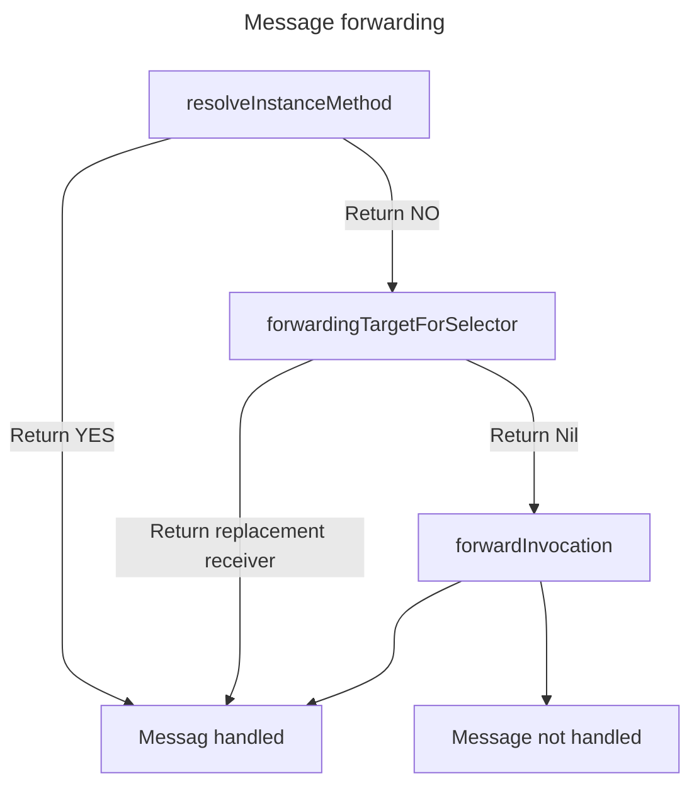

# Effective-Objective-C

## 适应OC

### OC是消息调用， 而不是直接的函数调用

### 最小化import

import会增加header的大小，尽可能的最小化import， 将import放在.m, .c, cpp, .mm文件中
可以使用以下形式最小化

```objective-c
#import <Foundation/Foundation>
@class EOCEmployer;

@interface EOCPerson: NSObject
@property (nonatomic, copy) NSString *firstName;
@property (nonatomic, copy) NSString *lastName;
@property (nonatomic, strong) EOCEmployer *employer;
@end
```

而在EOCPerson.m文件中

```objective-c
#import "EOCPerson.h"
#import "EOCEmployer.h"

@implementation EOCPerson
//Implementation of methods
@end
```

对于protocol， 如果不向外暴露的话， 可以考虑在.m文件中实现

### 优先使用字面量

```objective-c
NSNumber *someNumber = [NSNumber numberWithInt: 1];
//but this is better
NSNumber *someNumber = @1;
```

### 优先使用类型常量而不是宏

优先把常量声明在.m中, .h文件可以通过**_extern_**引入

```objective-c
//EOCLoginManager.h
#import <Foundation/Foundation.h>
extern NSString *const EOCLoginManagerDidLoginNotification;

@interface EOCLoginManager: NSObject
- (void) login;
@end

///EOCLoginManager.m
#import "EOCLoginManager.h"

NSString *const EOCLoginManagerDidLoginNotification = @"EOCLoginManagerDidLoginNotification";

@implementation EOCLoginManager

-(void) login{

}

-(void) p_didLogin{
    [[NSNotificationCenter defaultCenter]
        postNotificationName: EOCLoginManagerDidLoginNotification
            object: nil];
}
@end
```

### 使用枚举来管理状态

NS_ENUM 在是否是C++环境下有不同的定义
C++环境下，两个枚举按位或所得值将会是NSUInteger， 而不是枚举本身
同时不允许隐式转换成枚举
在需要操作枚举值的情况下，应使用NS_OPTIONS

```objective-c
typedef NS_ENUM(NSUInteger, EOCConnectionState) {
    EOCConnectionStateDisconnected,
    EOCConnectionStateConnecting,
    EOCConnectionStateConnected,
};

switch(_currentState){
    EOCConnectionStateDisConnected:
        //Handle disconnected state
        break;
    EOCConnectionStateConnecting:
        //Handle connecting state
        break;
EOCConnectionStateConnected:
        //Handle connected state
        break;
}
```

## Objects, Messaging & Runtime

### properties

尽可能使用getter和setter来访问instance variable 而不是通过直接访问
通过增加@synthesize 关键字可以重命名getter跟setter方法构造的方法名

```objective-c
@implementation EOCPerson
@synthesize firstName = _myFirstName;
@synthesize lastName = _myLastName;
```

使用@dynamic关键字可以是编译器不生成实例变量来支撑属性， 并且getter和setter也不生成
在CoreData的NSManagedObject中还是比较常用的

```objective-c
@interface EOCPerson: NSManagedObject
@property NSString *firstName;
@property NSString *lastName;
@end

@implementation EOCPerson
@dynamic firstName, lastName;
@end
```

### 尽量直接访问变量，通过setter设置变量(内部相互调用下)

### Object 的Equality

以下两个方法是相等检查的核心

```objective-c
-(BOOL) isEqual: (id)object;
-(NSUInteger)hash;
```

跟Java一样, 重写这两个方法可以定义自己的相等判断
hash方法中不宜定义过长的处理逻辑
同时不应该让hash值依赖于可变部分

```objective-c
NSMutableSet *set = [NSMutableSet new];

NSMUtableArray *arrayA = [@[@1, @2] mutableCopy];
[set addObject: arrayA];
//Ouput: set = {((1, 2))}

NSMutableArray *arrayB = [@[@1, @2] mutableCopy];
[set addObject: arrayB];
//Output: set = {((1, 2))}

MSMutableArray *arrayC = [@[@1] mutableCopy];
[set addObject: arrayC];
//Output: set = {((1), (1, 2))}

[arrayC addObject:@2];
//Output: set = {((1, 2), (1, 2))}

NSSet *setB = [set copy];
//Output: setB = {((1, 2))}
```

### 使用类簇(Class Cluster)隐藏实现细节

类簇模式看下面代码就懂了

```objective-c
typedef NS_ENUM(NSUInteger, EOCEmployeeType){
    EOCEmployeeTypeDeveloper,
    EOCEmployeeTypeDesigner,
    EOCEmployeeTypeFinance,
};

@interface EOCEmployee: NSObject
@property (copy) NSString *name;
@property NSUInteger salary;

//Helper for creating Employee objects
+(EOCEmployee*)employeeWithType:(EOCEmployeeType)type;

// Make Employees do their respective day's work
-(void) doADaysWork;
@end

@implementation EOCEmployee
+ (EOCEmployee *)employeeWithType:(EOCEmployeeType)type{
    switch(type){
        case EOCEmployeeTypeDeveloper:
            return [EOCEmployeeDeveloper new];
            break;
        case EOCEmployeeTypeDesigner:
            return [EOCEmployeeDisigner new];
            break;
        case EOCEmployeeTypeFinance:
            return [EOCEmployeeFinance new];
            break;
    }
}

- (void) doADaysWork{
    //Subclasses implement this.
}
@end

//sub class implementation
@interface EOCEmployeeDeveloper: EOCEmployee
@end

@implementation EOCEmployeeDeveloper
- (void) doADaysWork{
    [self writeCode];
}
@end
```

### 使用关联对象将自定义数据关联到class上

第一种是用delegate

```objective-c
-(void)askUserAQuestion{
    UIAlertView *alert = [[UIAlertView alloc]
        initWithTitle: @"Question"
        message: @"What do you want to do?"
        delegate: self
        cancelButtonTitle:@"Cancel"
        otherButtonTitles:@"Continue", nil
    ];
    [alert show];
}

-(void) alertView:(UIAlertView *)alertView
        clickedButtonAtIndex:(NSInteger)buttonIndex{
    if(buttonIndex == 0){
        [self doCancel];
    } else {
        [self doContinue];
    }
}
```

第二种是用以下两个方法

```objective-c
void objc_setAssociatedObject(id object, void *key, id value,
    objc_AssociationPolicy policy)

id objc_getAssociatedObject(id object, void *key)
```

```objective-c
#import <objc/runtime.h>

static void *EOCMyAlertViewKey = "EOCMyAlertViewKey";

-(void) askUserAQuestion {
    UIAlertView *alert = [[UIAlertView alloc]
        initWithTitle:@"Question"
        message:@"What do you want to do?"
        delegate: self
        cancelButtonTitle:@"Cancel",
        otherButtonTitles:@"Continue", nil];
    void (^block)(NSInteger) = ^(NSInteger buttonIndex){'
        if(buttonIndex == 0){
            [self doCancel];
        } else {
            [self doContinue];
        }
    };
    objc_setAssociatedObject(alert, EOCMyAlertViewKey, block, OBJC_ASSOCIATION_COPY);
    [alert show];
}

-(void) alertView:(UIAlertView *) alertView
        clickedButtonAtIndex:(NSInteger)buttonIndex{
    void (^block)(NSInteger) = objc_getAssociatedObject(alertView, EOCMyAlertViewKey);
    block(buttonIndex);
}
```

通过这种方法,可以将alertView的代码聚焦在一起,但要小心捕获变量问题

### 了解objc_msgSend

OC函数调用都是走的消息, 即

```objective-c
void objc_msgSend(id self, SEL cmd, ...)

id returnValue = objc_msgSend(someObject, @selector(massageName:), parameter);
```

对于一些边缘情况, OC有以下方法:

```objective-c
objc_msgSend_stret
//返回一个结构体

objc_msgSend_fpret
//返回一个浮点值

objc_msgSendSuper
//发送消息给父类
```

### 了解消息转发

消息转发分为两部分

1. 提供给receiver所在的类一个动态添加方法的机会, 即dynamic method resolution
2. 全转发机制, 询问receiver是否有替代的类响应selector, 如果有, 则转移消息,正常进行.
   否则将会唤起完整转发机制, 使用NSInvocation对象容纳message的全部信息,并给receiver最后一次机会

第一种方法通过一些方法实现

```objective-c
+(BOOL)resolveInstanceMethod:(SEL)selector
+(BOOL)resulveClassMethod:(SEL)selector
//and more
```

询问receiver释放有替代的响应selector通过该方法实现

```objective-c
- (id)forwardingTargetForSelector:(SEL)selector
```

完整转发机制通过这个方法

```objective-c
-(void)forwardInvocation:(NSInvocation *)invocation
```

可以使用该方法修改目的地,消息的参数, 修改selector等
该方法会不停沿父类传播直到NSObject, 抛出doesNotReconizeSelector:
整体机制如下:



示例代码:

```objective-c
//EOCAutoDictionary.h
#import <Foundation/Foundation.h>

@interface EOCAutoDictionary : NSObject
@property(nonatomic, strong) NSString *string;
@property(nonatomic, strong) NSNumber *number;
@property(nonatomic, strong) NSDate *date;
@property(nonatomic, strong) id opaqueObject;
@end


//EOCAutoDictionary.m
#import "EOCAutoDictionary.h"
#include <Foundation/Foundation.h>
#import <objc/runtime.h>

@interface EOCAutoDictionary ()
@property(nonatomic, strong) NSMutableDictionary *backingStore;
@end

id autoDictionaryGetter(id self, SEL _cmd) {
  EOCAutoDictionary *typedSelf = (EOCAutoDictionary *)self;
  NSMutableDictionary *backingStore = typedSelf.backingStore;

  NSString *key = NSStringFromSelector(_cmd);
  return [backingStore objectForKey:key];
}

void autoDictionarySetter(id self, SEL _cmd, id value) {
  EOCAutoDictionary *typedSelf = (EOCAutoDictionary *)self;
  NSMutableDictionary *backingStore = typedSelf.backingStore;
  NSString *selectorString = NSStringFromSelector(_cmd);
  NSMutableString *key = [selectorString mutableCopy];

  [key deleteCharactersInRange:NSMakeRange(key.length - 1, 1)];
  [key deleteCharactersInRange:NSMakeRange(0, 3)];
  NSString *lowercaseFirstChar = [[key substringToIndex:1] lowercaseString];
  [key replaceCharactersInRange:NSMakeRange(0, 1)
                     withString:(lowercaseFirstChar)];

  if (value) {
    [backingStore setObject:value forKey:key];
  } else {
    [backingStore removeObjectForKey:key];
  }
}
@implementation EOCAutoDictionary
@dynamic string, number, date, opaqueObject;

- (id)init {
  if ((self = [super init])) {
    _backingStore = [NSMutableDictionary new];
  }
  return self;
}

+(BOOL) resolveInstanceMethod:(SEL)selector {
  NSString *selectorString = NSStringFromSelector(selector);
  if ([selectorString hasPrefix:@"set"]) {
    class_addMethod(self, selector, (IMP)autoDictionarySetter, "v@:@");
  } else {
    class_addMethod(self, selector, (IMP)autoDictionaryGetter, "@@:");
  }
  return YES;
}
@end

//main.m

#import "EOCAutoDictionary.h"
#import <Foundation/Foundation.h>
int main(int argc, const char *argv[]) {
  @autoreleasepool {
    // insert code here...
    NSLog(@"Hello, World!");
    EOCAutoDictionary *dict = [EOCAutoDictionary new];
    dict.date = [NSDate dateWithTimeIntervalSince1970:475372800];
    NSLog(@"dict.date = %@", dict.date);
  }
  return 0;
}
```
